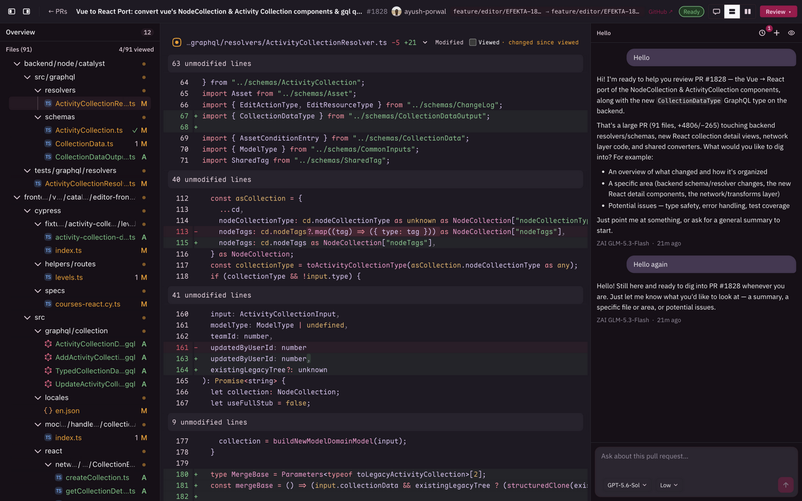
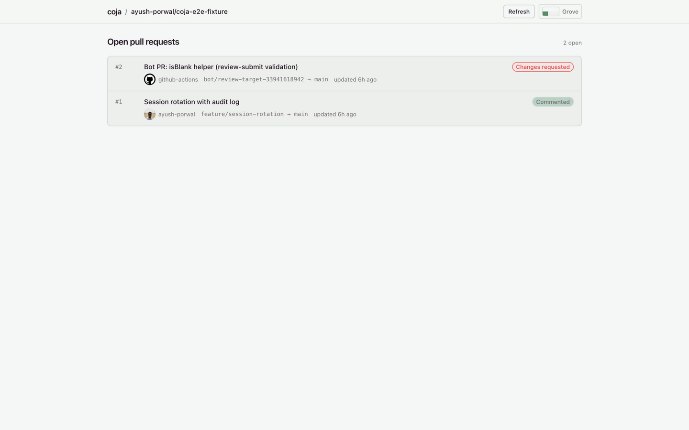

# Coja

[](https://www.npmjs.com/package/@ayushporwal/coja)
[](./LICENSE)
[](./server/package.json)

Local code review for GitHub pull requests, with an AI sidepanel that helps the human reviewer.

Coja pulls a pull request into a local clone and reviews it in a fast, GitHub-style diff UI — file tree, line comments, pending review, approve or request changes. An AI sidepanel sits next to the diff, grounded in the same PR: it reads the changed files, answers questions, and helps you write the review. Everything runs on your machine.

| | |
|---|---|
|  |
|  |

## Quick start

```sh
npm install -g @ayushporwal/coja
coja
```

Coja starts a local server on `http://localhost:4321` and opens your browser. First-run setup walks you through:

1. **GitHub token** — used to read repositories and pull requests. Stored in your OS keychain, never on our servers (there are none).
2. **A project** — point Coja at an existing local checkout, or let it clone the repository for you.
3. **An AI provider key** *(optional)* — OpenAI, Anthropic, or a custom OpenAI-compatible endpoint. Only needed for the AI sidepanel; review without it works fine.

Requirements: Node.js 22.13 or newer. macOS, Linux and Windows.

## What you get

- **A real diff, fetched locally** — Coja fetches the PR's head and merge base into git and renders the changed files itself, with viewed-state tracking per file.
- **Pending reviews** — mark up lines and files, collect comments, then submit the review to GitHub as comment, approve, or request changes.
- **An AI sidepanel that knows the PR** — the chat is grounded in the PR detail and its changed files; attach selections, lines or whole files as context chips; keep several conversations per PR with auto-generated titles.
- **Model choice** — pick a model per conversation from OpenAI, Anthropic, or your own OpenAI-compatible endpoints, with per-model reasoning effort.
- **Local-first** — the clone, the database, the chat history and the secrets all live on your machine.

## Development

```sh
pnpm install
pnpm dev        # server on :4321, web dev server on :5173 (proxied)
pnpm check      # typecheck + lint + tests
pnpm build      # web → server/public, server → server/dist
```

- `web/` — React + Vite UI (themes, diff views, AI panel)
- `server/` — Hono server, git plumbing and the published CLI (`@ayushporwal/coja`)
- `docs/` — design notes, progress log, decisions and screenshots

Releases are automated: a PR that bumps `server/package.json` publishes the new version to npm when it merges to `main` (`.github/workflows/publish.yml`).

## License

[MIT](./LICENSE)
