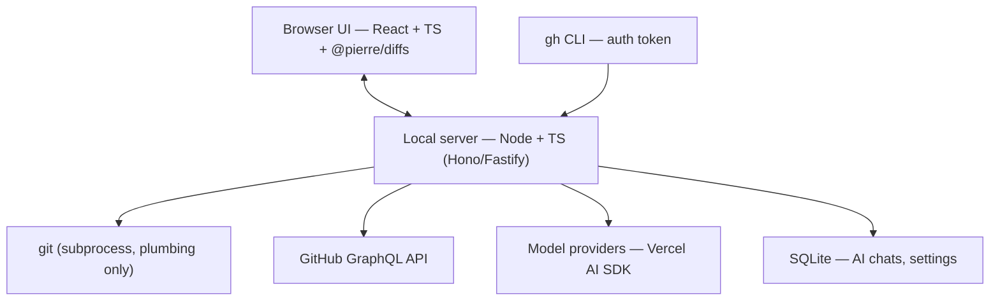
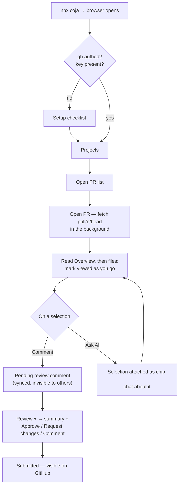

# coja — design doc

A local, open-source code review app: review GitHub PRs in a fast diff UI with an
AI sidepanel that helps the **human** reviewer understand the changes. The AI never
reviews on its own, never edits code, and never executes anything.

## v1 scope

- Add a project by pointing at a **local clone** of a GitHub repo (we read `origin`
  from its git config) or by cloning via GitHub.
- List open PRs for the repo; open one.
- Read-only diff view with syntax highlighting.
- Inline review: add comments, reply to threads, approve / request changes /
  comment — all synced with GitHub.
- AI sidepanel: chat about the PR with automated, fully transparent context
  attachment.
- BYOK model providers: OpenAI and Anthropic API keys.
- Auth exclusively through the GitHub CLI (`gh`). No PATs, no OAuth flow of our own.

Non-goals for v1 (see [Later](#later)): other forges, PR inbox/triage, CI status,
AI-authored reviews, editing or running code, hosted/multi-user anything.

## Architecture

Local server + browser UI, published as **one npm package**:



- `npx coja` starts the server and opens the browser. The built Vite frontend is
  bundled into the package as static assets served by the server — one package,
  one command.
- Repo layout: monorepo with `server/` and `web/` workspaces; publish only the
  server package with `web`'s build output embedded.
- Backend is Node/TypeScript. Rationale: the harness sits on the Vercel AI SDK
  (TS-only) and the frontend shares types with the server. The backend is thin
  (git subprocesses + GraphQL + agent loop), so a later Go rewrite stays cheap
  if we want one.

## Git layer: objects, not checkouts

Core principle: **PR code is git objects, never files on disk.** No worktrees,
no checkouts — not for the app, not for the agent, not for the user.

- Fetch a PR with GitHub's hidden refs: `git fetch origin pull/<n>/head` —
  works for fork PRs without adding the fork as a remote.
- Everything reads from objects via plumbing:
  - file at a commit: `git show <sha>:<path>`
  - per-file or full diff: `git diff <base>...<head>`
  - search at a commit: `git grep <pattern> <sha>`
  - tree listing: `git ls-tree`
  - history/authorship: `git log`, `git blame`
- The user's own checkout and branches are never touched.

There is no "open in IDE" worktree either — the agent (and the diff UI) can
read the whole repository at any commit from objects, so nothing needs files
on disk. A detached-worktree "open in my IDE" action is parked in
[Later](#later).

## GitHub integration

- **Auth:** `gh` CLI is a hard prerequisite. We obtain the token via
  `gh auth token`; if `gh auth status` fails, the UI says "run `gh auth login`".
  Nothing else — no PAT entry, no OAuth app. (A registered GitHub App with
  fine-grained permissions is the right shape only if coja ever becomes a
  hosted service.)
- **API:** GraphQL (`api.github.com/graphql`) — it models reviews, threads, and
  pending state better than REST.
- **Sync model: GitHub is the source of truth for all review state.** Every
  user action that GitHub can represent is synced immediately, so a review
  survives switching machines:
  - Draft comments → GitHub **pending review** (comments attached to a pending
    review are invisible to others until submitted; this state lives
    server-side on GitHub).
  - Submit review → `APPROVE` / `REQUEST_CHANGES` / `COMMENT` event.
  - Replies → review thread replies.
  - Viewed-file checkmarks → `markFileAsViewed` mutation.
  - Local SQLite stores only what GitHub can't: AI chat history and app
    settings.
- All GitHub calls go through one internal `Forge` interface (list PRs, fetch
  refspec for PR, threads, comments, reviews, viewed state). GitHub is the only
  v1 implementation; the interface exists so another provider is additive later.

## Diff UI

- **[`@pierre/diffs`](https://diffs.com)** (React components, Shiki
  highlighting). Chosen because it's fast, battle-tested, and fits us exactly:
  - Renders from a patch **or** from two file versions — both come straight
    from git plumbing on the server.
  - Annotation framework → inline comment threads.
  - Line selection/highlighting → feeds "select code → AI context".
- Read-only. No edit mode.

## AI sidepanel

Purpose: the reviewer talks to an AI about the PR to understand the changes
faster. The AI assists the human; the human reviews.

UX principles:

- **Automated context, minimal copy-paste.** Selecting code in the diff
  attaches that span (file, lines, side) to the next message as a context
  block. PR title/description and the diff summary are attached to the
  conversation by default.
- **Full transparency.** Every message shows exactly what was sent to the
  model — attached context blocks are visible and expandable, and the agent's
  tool calls and their results are rendered in the chat. Nothing goes to the
  model that the user can't see.

Context available to the agent (all from git objects / GitHub API):

- PR title, description, commit messages
- The diff, per file
- **Any file in the repo at the base or head commit** — the agent is not
  limited to the diff; via its tools it has the same visibility as a checkout
- History (`git log`) and authorship (`git blame`) for "why" questions

## Screens and UX flow

Four screens total.

### 1. Setup (first run only)

A checklist, not a wizard:

- **GitHub:** run `gh auth status` → green check, or "run `gh auth login` in
  your terminal" with a retry button. No input fields.
- **AI provider:** paste an OpenAI or Anthropic API key → OS keychain,
  validated with a cheap test call. Skippable — reviewing without AI must
  work.

Once green (or AI skipped), the user lands on Projects and never sees this
screen again unless something breaks.

### 2. Projects → PR list (home)

- Empty state: "Add a project" — a path to a local clone (we read `origin` to
  identify the GitHub repo) or a GitHub `owner/repo` to clone into app
  storage.
- A project opens its **open-PR list**: title, author, source branch,
  updated-at, the user's review state (none / pending / approved / changes
  requested). Click a PR → review screen. No inbox, no cross-repo triage
  (parked in Later).

### 3. PR review screen (the core)

Three-zone layout:

```
┌────────────────────────────────────────────────────────┐
│ PR title · #123 · author · branch → base   [Review ▾]  │
├──────────┬────────────────────────────┬────────────────┤
│ Overview │                            │                │
│ file     │      diff viewer           │   AI chat      │
│ tree     │      (@pierre/diffs)       │   (collapsible)│
│ (changed │                            │                │
│  files)  │  inline comment threads    │                │
└──────────┴────────────────────────────┴────────────────┘
```

- **Left — changed-files tree**, rendered with `@pierre/trees` (`FileTree`).
  Per entry: change type (+/−/M), comment-count badge, viewed checkmark
  (synced via `markFileAsViewed`). An **Overview** entry above the tree holds
  the PR description, commit list, and the top-level (non-diff) conversation.
- **Center — diff.** Read-only. One continuous, lazily rendered scroll of all
  files — tree entries jump-scroll; stacked/split toggle. Existing GitHub
  review threads render inline via the annotation framework and replies
  happen in place. Selecting a line or range opens a two-action popover:
  **Comment** (into the pending review) and **Ask AI** (attach selection to
  the chat composer).
- **Right — AI panel.** Collapsible; open by default on the user's first PR,
  then remembers the last state.
- **Top bar — Review button** with pending-comment count → submit dialog:
  summary text + Approve / Request changes / Comment. Submitting fires the
  GitHub review event; pending comments become visible to everyone.

### 4. AI panel anatomy

One conversation per PR (SQLite, resumable), with a "new chat" action; old
chats stay accessible per PR. The transparency rules shape the design:

- **Composer with context chips.** "Ask AI" on a selection adds a chip
  (`src/auth.ts:41–58 @ head`); chips are removable before sending and
  expandable, so the exact text going to the model is always inspectable. The
  standing system context (PR title/description, changed-file list) is
  inspectable too — a "what does the AI see?" affordance, nothing hidden.
- **Messages show everything.** User messages render their attached chips;
  agent turns render each tool call (`read_file(head, src/auth.ts)`) with a
  collapsed, expandable result.
- **Citations navigate.** `file:line` in agent output is a link that scrolls
  the diff there — the read direction of the same select→attach bridge.
- Model picker in the panel header.

### Flow



Pinned flow details:

- **Fetch is lazy and non-blocking.** Opening a PR starts
  `git fetch origin pull/<n>/head` in the background; PR metadata and the
  file list come from the API immediately, diffs render as objects arrive.
  Re-opening re-fetches only if the head SHA moved.
- **Crash-safe by construction.** Pending comments and viewed-state live on
  GitHub, so killing the server mid-review loses nothing but scroll position.

## Harness and security model

We build our own loop on the **Vercel AI SDK** (`streamText` + `tools` +
`stopWhen`). For a handful of read-only tools this is a few hundred lines; a
general-purpose harness (pi-agent, opencode) would mean depending on a coding
agent and amputating its dangerous tools. External agents via ACP (Agent
Client Protocol) are **ruled out, not deferred**: full control over the tool
surface is a core security requirement, and an external agent runs its own
tools in its own process. Required reading: Thorsten Ball's
"How to Build an Agent" (ampcode.com) and Mario Zechner's pi writeups — both
show the core loop is small. Reference codebases when stuck on specifics:
opencode, pi-mono.

Security principles — the agent gets **no working tree, no shell, no write, no
network**:

- Tool surface (all git plumbing against fetched objects):
  `read_file(ref, path)`, `list_files(ref)`, `grep(ref, pattern)`,
  `get_diff(file?)`, `git_log`, `git_blame`.
- No `bash` tool ever — a shell is never actually read-only.
- PR code is never executed and never exists as files on disk.
- **Prompt injection is the main threat**: PR content is untrusted input inside
  the model's context. Mitigations: the AI cannot post comments or submit
  reviews — it drafts, the human sends; and its tools expose nothing secret to
  leak.

## Model providers

- Vercel AI SDK with the OpenAI and Anthropic providers; adding more later is
  a few lines each.
- **v1 = API keys** (platform.openai.com / console.anthropic.com), stored in
  the OS keychain. The only path that is documented and stable for both
  providers.
- **OpenAI subscriptions ("Sign in with ChatGPT"):** experimental opt-in soon
  after v1. OpenAI officially supports ChatGPT-subscription auth for Codex,
  and third-party apps (opencode, community SDKs incl. an AI SDK provider)
  ride the public Codex OAuth client against `chatgpt.com/backend-api/codex`
  without pushback. Undocumented and revocable, so: opt-in, with API-key
  fallback, drawing from the plan's Codex limits.
- **Anthropic subscriptions: no.** Anthropic actively blocks third-party use
  of Claude Pro/Max OAuth: anti-spoofing safeguards since Jan 2026 (with user
  account bans), and since April 2026 third-party OAuth traffic bills to
  pay-as-you-go "extra usage" rather than plan limits anyway. Revisit only if
  Anthropic opens a sanctioned path.
- No gateways (OpenRouter/Bedrock/Cloudflare) in v1; they solve hosted-product
  problems a local BYOK app doesn't have.

## Tech stack summary

| Layer | Choice |
|---|---|
| Distribution | single npm package, `npx coja` |
| Server | Node + TypeScript (Hono or Fastify) |
| Git | `git` subprocess, plumbing only |
| Frontend | React + TypeScript + Vite + Tailwind |
| Diff rendering | `@pierre/diffs` |
| File tree | `@pierre/trees` |
| GitHub | GraphQL API, token from `gh auth token` |
| AI | Vercel AI SDK, own agent loop, read-only tools |
| Local state | SQLite (AI chats, settings) |

## Build order (suggested)

1. Monorepo scaffold (`server/`, `web/`), `npx coja` entry: start server,
   serve static UI, open browser.
2. Git layer (plumbing wrappers) + `Forge` interface + gh-CLI auth.
3. Projects → PR list → read-only diff view (`@pierre/diffs`,
   `@pierre/trees`).
4. Review sync: pending comments, threads/replies, viewed-state, submit
   review.
5. AI panel: agent loop, read-only tools, context chips, transparency UI.

Each step is independently usable; 1–4 make a complete review tool with no AI.

## Later

Parked deliberately to keep v1 minimal:

- PR inbox ("PRs awaiting my review" across projects)
- CI/check status inline
- Keyboard-first navigation
- Re-review support (`git range-diff` between force-pushed rounds)
- Auto-generated review briefs / suggested reading order
- Large-PR context strategy (hierarchical summarization)
- Token/cost visibility per PR
- More providers via the `Forge` interface (GitLab, Gitea, …)
- More model providers / OpenRouter / Ollama
- "Open PR in my IDE" via a detached git worktree (with a fork-PR caution —
  opening untrusted code in an IDE can trigger tasks/build scripts)
